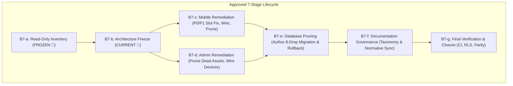

# Phase B7-b Architecture & Design Freeze: Feature Lifecycle, Zombie Architecture & Doc Governance

**Phase Status:** 🧊 DESIGN FREEZE PROPOSED (Ready for Review)  
**Date:** 2026-09-12  
**Repositories:** `carvele/jezsy-mobile-app` (Canonical Schema Owner) & `carvele/admin-dashboard`  
**Database:** Shared Live Supabase Project (`wufcmtndotfvxvvxkamv`)  
**Baseline Inherited From B7-a:** 127 live public procedures (53 Active, 62 Internal, 6 Dormant, 6 Zombie), 33 detailed finding entries, zero uncommitted mutations.

---

## 1. Lifecycle & Governance Overview

Phase **B7-b** freezes the architectural design, contract specifications, and execution sequence for resolving technical debt, orphaned code, contract mismatches, and documentation drift across the JezSy ecosystem.



---

## 2. Five Frozen Decision Groups

### Decision Group 1: Mobile Remediation Contract (`B7-c`)

Five dedicated workstreams are frozen for `jezsy-mobile-app`:

#### `B7-C1`: Slot Availability Correctness (Priority P0/P1)
- **Problem:** `components/TimeSlotPicker.tsx` queries raw `reservations` table and aggregates booking counts client-side. Live PostgreSQL RLS (`Enable select for own reservations or owner`) restricts customer queries strictly to `customer_id = auth.uid()`. Normal customers see zero bookings for other users, causing occupied appointment slots to appear completely vacant.
- **Remediation:**
  - Refactor `TimeSlotPicker.tsx` to invoke the canonical `public.get_slot_booked_counts(_date)` RPC (`SECURITY DEFINER`).
  - Preserve all existing store hours, boutique closures, and per-slot capacity logic.
  - Remove client-side reservation looping and raw table queries.
- **Critical Invariant:**
  > [!IMPORTANT]
  > The `get_slot_booked_counts` RPC improves **availability presentation** in the UI. Final reservation creation (`create_reservation` / `save_reservation`) remains the authoritative server-side locking boundary against concurrency and booking races. The availability presentation check must **not** become the sole anti-overbooking mechanism.

#### `B7-C2`: Username Lifecycle Completion
- **Problem:** `app/profile/edit.tsx` initializes `username` state, loads it from `profile.username`, and includes it in `handleSubmit` with uniqueness validation, but **omits `<TextInput>` in the rendered JSX**. The form jumps directly from Name to Personal Info.
- **Remediation:**
  - Render a styled, accessible `TextInput` for `username` in `app/profile/edit.tsx` (between Name and Personal Info).
  - Retain database uniqueness constraint (`profiles_username_key`) as the authoritative validation gate.
  - Gracefully handle PostgreSQL error code `23505` with a user-friendly message: `"This username is already taken. Please choose another."`
  - Do not duplicate username state rules or add brittle client-side race validations.

#### `B7-C3`: Suggested Connections Integration
- **Problem:** High-quality SQL recommendation engine `public.get_suggested_connections()` exists in the live database, but `app/network.tsx` Discover tab shows an empty state or recent queries on blank input.
- **Remediation:**
  - When the search query is empty, invoke `get_suggested_connections()` and render friend-of-friend boutique connections.
  - When the user types into the search field, execute the existing explicit substring search.
  - Recommendations must never collide with or replace explicit search query results.

#### `B7-C4`: Public Profile Collection Semantics
- **Problem:** `app/user/[id].tsx` labels its collection section "Wardrobe", gates client visibility using `profile.wardrobe_privacy`, but queries `public.wishlists`. PostgreSQL RLS on `wishlists` prevents unauthorized data leaks, but domain and UI presentation are conflated.
- **Remediation:**
  - Standardize domain semantics in `app/user/[id].tsx`:
    - Display explicit, separate tabs or sections for **"Wardrobe"** (querying `wardrobe_items` and gated by `wardrobe_privacy`) and **"Wishlist"** (querying `wishlists` and gated by `wishlist_privacy`).
    - Align client gating strictly with the domain table being fetched.

#### `B7-C5`: Expo Starter Template Pruning
- **Problem:** 8 unused starter template files from `create-expo-app` inflate the codebase: `app/modal.tsx`, `app/_layout.tsx:376` route registration, `components/themed-text.tsx`, `components/themed-view.tsx`, `components/hello-wave.tsx`, `components/external-link.tsx`, `components/parallax-scroll-view.tsx`, and `components/ui/collapsible.tsx`.
- **Remediation:**
  - Perform final verification of routes, deep links, and component imports.
  - Safely prune all 8 files and remove `<Stack.Screen name="modal" ... />` from `app/_layout.tsx`.

---

### Decision Group 2: Admin Remediation Contract (`B7-d`)

Four dedicated workstreams are frozen for `admin-dashboard`:

#### `B7-D1`: Delete Proven Orphaned Files
- **Remediation:**
  - Delete `src/pages/customers/Feedbacks.css` (144 lines, no JSX component).
  - Delete `src/services/feedbackService.js` (30 lines, zero repository callers).
  - Delete `src/pages/wardrobe/OutfitSuggestions.css` (842 lines, zero callers; Tailwind classes used in `StyleInspiration.jsx`).
  - Delete `test_modal_regex.py` (25 lines, temporary root scratch script).

#### `B7-D2`: Firestore Type Escape Removal
- **Problem:** `src/types/index.ts` contains 226 lines of dead Firebase/Firestore schema definitions. Only `src/components/TopNav.tsx` imports a single interface `User`.
- **Remediation:**
  - Refactor `TopNav.tsx` to import its user profile definition from `src/types/database.types.ts` or the auth context.
  - Delete `src/types/index.ts` once zero callers remain across the repository.

#### `B7-D3`: Soft-Delete Cleanup & Domain Scoping
- **Problem:** `softDeleteDocument` in `src/lib/supabaseService.js` writes `{ deleted: true, deleted_at: now, updated_at: now }`. `reservations` lacks `deleted_at`, and `categories` lacks both `deleted` and `deleted_at`.
- **Remediation:**
  - Remove dead export `deleteCategory` from `src/services/productService.js` (production UI uses `deleteCategoryAdmin`).
  - Remove dead export `deleteReservation` from `src/services/customerService.js` (production reservation deletion uses `reservationService.deleteReservation`).
  - Constrain generic `softDeleteDocument` exclusively to its proven compatible domain: `products`.
  - **Do NOT** introduce complex runtime schema introspection.

#### `B7-D4`: Audited Device Command Boundary
- **Problem:** `src/services/deviceService.js:37-65` executes direct table DML (`.update()`, `.delete()`) on `public.devices`, completely bypassing `admin_manage_device` and `admin_prune_devices` and omitting audit records from `public.logs`.
- **Remediation:**
  - Refactor `deviceService.js`:
    - `approveDevice(fingerprint)` -> invoke `supabase.rpc('admin_manage_device', { _fingerprint: fingerprint, _action: 'approve' })`.
    - `revokeDevice(fingerprint)` -> invoke `supabase.rpc('admin_manage_device', { _fingerprint: fingerprint, _action: 'revoke' })`.
    - `renameDevice(fingerprint, name)` -> invoke `supabase.rpc('admin_manage_device', { _fingerprint: fingerprint, _action: 'rename', _value: name })`.
    - `deleteDevice(fingerprint)` -> invoke `supabase.rpc('admin_manage_device', { _fingerprint: fingerprint, _action: 'delete' })`.
    - `pruneDevices(cutoff)` -> invoke `supabase.rpc('admin_prune_devices', { _cutoff: cutoff })`.
  - Remove all direct `.update()` and `.delete()` queries on `devices`.
  - Database authorization (`is_admin_or_owner()`) remains authoritative. UI behavior matches the authorization model; do **not** broaden privileges client-side.

---

### Decision Group 3: Database Pruning Contract (`B7-e`)

A separately gated operation to safely drop 8 authorized procedures:

#### Authorized Prune Procedures (8 Functions)

**6 Evidence-Proven ZOMBIE Procedures:**
1. `public.auto_cancel_expired_reservations()` — Retired cron wrapper.
2. `public.expire_unpaid_reservations()` — Redundant wrapper.
3. `public.update_staff_role(target_user_id uuid, new_role text)` — Redundant `SECURITY INVOKER` alias to `update_staff_role_v2`.
4. `public.complete_reservation_pickup(_reservation_id uuid, _pickup_token uuid, _method text)` — Superseded precursor to `complete_reservation_handover`.
5. `public.verify_pickup(_pickup_token uuid)` — Superseded precursor to `complete_reservation_handover`.
6. `public.check_email_exists(lookup_email text)` — Orphaned pre-signup enumeration surface.

**2 Design-Authorized Dormant Procedures (Resolved in B7-b):**
7. `public.reschedule_reservation(_reservation_id uuid, _date text, _appointment_time text)` — Superseded by two-phase customer request / manager resolution workflow.
8. `public.search_catalog_fuzzy(search_term text, p_limit integer)` — Superseded by faceted `search_catalog`.

#### Pruning Execution Standards
- **Dependency Guard:** Re-run live database dependency checks (`pg_depend`, `cron.job`, RLS policies) immediately before authoring the migration.
- **Exact Signatures:** Every statement must specify exact argument signatures:
  ```sql
  DROP FUNCTION IF EXISTS public.auto_cancel_expired_reservations();
  DROP FUNCTION IF EXISTS public.expire_unpaid_reservations();
  DROP FUNCTION IF EXISTS public.update_staff_role(uuid, text);
  DROP FUNCTION IF EXISTS public.complete_reservation_pickup(uuid, uuid, text);
  DROP FUNCTION IF EXISTS public.verify_pickup(uuid);
  DROP FUNCTION IF EXISTS public.check_email_exists(text);
  DROP FUNCTION IF EXISTS public.reschedule_reservation(uuid, text, text);
  DROP FUNCTION IF EXISTS public.search_catalog_fuzzy(text, integer);
  ```
- **Migration Pair:**
  - Forward: `supabase/migrations/20260912000002_prune_zombie_public_rpcs.sql`
  - Rollback: `supabase/migrations/20260912000002_prune_zombie_public_rpcs.sql.rollback` recreating the exact previous SQL bodies, security modes, search paths, and original grants.
- **Separation of Gates:**
  > [!CAUTION]
  > Authoring and testing the migration file in git is authorized under B7-b. However, **applying the migration to the shared live Supabase database requires an explicit, separate user approval gate**.
- **Type Parity Sync:** Immediately after approved application, regenerate `src/types/database.types.ts` and synchronize byte-for-byte across both repositories.

---

### Decision Group 4: Resolution of the Three `INVESTIGATE` Candidates

The three ambiguous candidates from B7-a are formally resolved:

1. **`reschedule_reservation` → `PRUNE`**  
   *Rationale:* Mobile and Admin are standardized on the two-phase workflow (`request_reschedule` for customers, `resolve_reschedule_as_manager` for managers). Retaining an uncalled single-step customer mutation RPC creates architectural ambiguity and bypasses boutique review.
2. **`search_catalog_fuzzy` → `PRUNE`**  
   *Rationale:* Production catalog search is completely owned by faceted `search_catalog` (with filtering by categories, price ranges, and availability). The experimental pg_trgm fuzzy RPC has zero callers and adds unnecessary maintenance surface.
3. **`get_public_outfits_for_product` → `RETAIN DORMANT`**  
   *Rationale:* Enabling community outfits on product pages is a product feature decision, whereas B7 is a lifecycle cleanup phase. The database capability will be retained dormant until deliberately activated or retired by the social roadmap.

---

### Decision Group 5: Documentation Governance Contract (`B7-f`)

Documentation hygiene focuses on updating **normative current-state material** while preserving immutable historical evidence:

1. **Normative Updates**:
   - Update `jezsy-mobile-app/docs/ARCHITECTURE.md` to reflect:
     - 48 PostgreSQL tables and current RLS architecture.
     - Native MediaPipe pose detection (`react-native-vision-camera`, `react-native-mediapipe-posedetection`, `react-native-worklets-core`).
     - PayMongo electronic payment gateway and webhook settlement.
     - Frozen B5 messaging architecture: Boutique Support (`conversations`/`messages`) and P2P Direct Chat (`direct_chats`/`direct_chat_participants`/`direct_messages`).
   - Update `admin-dashboard/README.md` to reflect:
     - React + Vite + Tailwind CSS styling.
     - Supabase Storage image buckets (`products`, `pose-images`).
     - Real-time RBAC and device management.
     - Removal of references to non-existent "schema migration tools in Settings".
2. **Centralized Taxonomy Index (`docs/README.md`)**:
   - Establish a `docs/README.md` in both repositories classifying every document into:
     - `NORMATIVE`: Active operational guides, contracts, and system specifications.
     - `HISTORICAL SNAPSHOT`: Point-in-time design/audit explorations.
     - `AUDIT LEDGER`: Completed, immutable verification ledgers (e.g., B2–B6 closure reports).
     - `SUPERSEDED`: Inactive legacy documentation.
   - **Rule:** Do **NOT** modify or inject headers into frozen historical audit ledgers.

---

## 3. Execution Sequence & PR Boundaries

```text
PHASE B7 EXECUTION ROADMAP

Step 1: B7-c Mobile Remediation (PR on jezsy-mobile-app)
  • Branch: feat/b7-mobile-lifecycle-remediation
  • P0/P1 Slot availability fix (TimeSlotPicker -> get_slot_booked_counts)
  • Username edit input & 23505 handling (app/profile/edit.tsx)
  • Suggested connections on empty discover (app/network.tsx)
  • Wardrobe vs Wishlist collection separation (app/user/[id].tsx)
  • Prune 8-file Expo template cluster
  • Verify: npx tsc --noEmit, npm run lint, npm test

Step 2: B7-d Admin Remediation (PR on admin-dashboard)
  • Branch: feat/b7-admin-lifecycle-remediation
  • Prune Feedbacks.css, feedbackService.js, OutfitSuggestions.css, test_modal_regex.py
  • Prune dead deleteCategory and customerService.deleteReservation exports
  • Scope softDeleteDocument to products
  • Wire deviceService to admin_manage_device and admin_prune_devices
  • Migrate TopNav to canonical types; remove src/types/index.ts
  • Verify: npm run type-check, npm run lint, npm test, npm run build

Step 3: B7-e Database Pruning (Separately Gated Migration)
  • Authored in jezsy-mobile-app: 20260912000002_prune_zombie_public_rpcs.sql + rollback
  • Explicit Production Gate: User confirms live application
  • Live migration applied to wufcmtndotfvxvvxkamv
  • Regenerate database.types.ts and synchronize byte-for-byte to Admin

Step 4: B7-f Documentation Hygiene (Both Repos)
  • Update Mobile docs/ARCHITECTURE.md and Admin README.md
  • Create docs/README.md taxonomy indices

Step 5: B7-g Final Verification & Closure
  • End-to-end automated test suites across both repos
  • Persona RLS regression test suite
  • Publish docs/audits/b7-verification-closure.md
  • Merge PRs and freeze Phase B7 🧊
```

---

## 4. Phase B7-b Approval Checklist

- [x] All 33 B7-a findings classified with explicit recommended dispositions.
- [x] P0/P1 slot availability defect prioritized with authoritative server-side invariant preserved.
- [x] Username edit and suggested connections feature wiring scoped cleanly.
- [x] Wardrobe vs Wishlist domain separation defined.
- [x] Admin orphaned assets and dead soft-delete exports identified for removal.
- [x] Audited device management RPC wiring scoped without privilege escalation.
- [x] 8 database pruning candidates confirmed with exact-signature drops and rollback requirements.
- [x] 3 `INVESTIGATE` candidates definitively resolved.
- [x] Documentation taxonomy established without altering immutable historical ledgers.
- [x] Production application gate explicitly decoupled from migration authoring.
